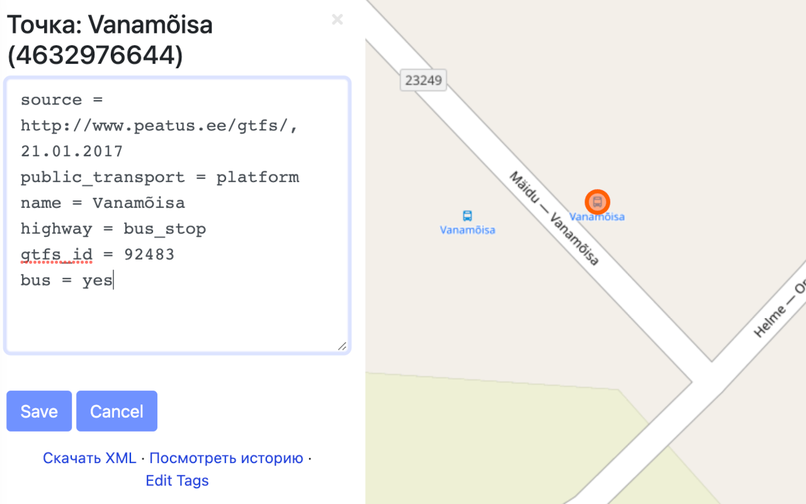

# OpenStreetMap Tags Editor

This is a WebExtension that adds an "Edit Tags" button to all node, way,
and relation pages on the [osm.org](https://www.openstreetmap.org) website.
The button opens a text area for editing raw tags (in form `key=value`) with
a "Save" button to upload changes.

## How to Install

Either open the development console and use the source code, or head over
to your browser's extension store:

* [Mozilla Firefox](https://addons.mozilla.org/firefox/addon/openstreetmap-tags-editor/)
* [Google Chrome](https://chrome.google.com/webstore/detail/openstreetmap-tags-editor/gcbcbndjajojkneicbfdaegcghgbdjnj)

## Author and License

Written by Ilya Zverev, published under MIT license.
